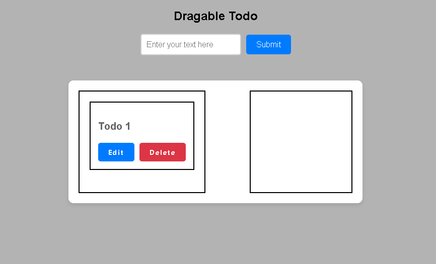
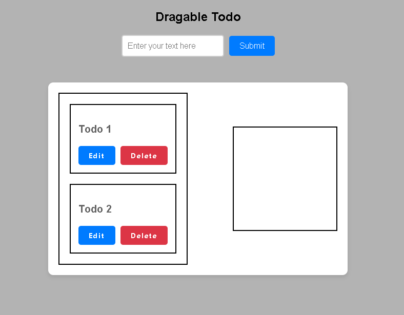

# Dragable Todo

I created a todo where you can drag any todo from left to right and right to left by just grabing the particular todo. I used Vanila Js for this.

## Demo

Insert gif or link to demo

## Features

- Add New Todo
- Delete Todo
- Update Todo
- After edit todo. Press enter to submit changes.

## Screenshots

